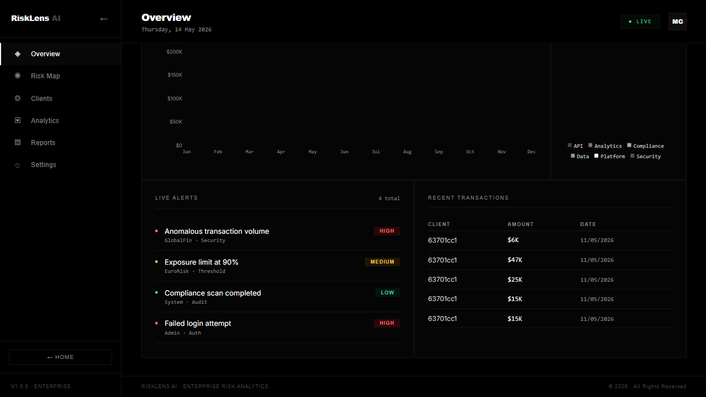

# RiskLens AI - Enterprise Risk Analytics Dashboard

Full-stack MERN analytics dashboard with an editorial landing page, risk monitoring views, client analytics, transactions, reports, and settings.



## Features

- Landing page with scroll animations and feature sections
- Dashboard overview with KPI cards, revenue trend, product mix, alerts, and transactions
- Risk map with score distribution, geographic exposure, and top-risk clients
- Clients view with search, filters, sorting, and inline risk indicators
- Analytics view with revenue, growth, industry, and product charts
- Reports and settings screens
- Express API backed by MongoDB and Mongoose

## Tech Stack

| Layer | Technology |
| --- | --- |
| Frontend | React 18, Vite, Recharts, MUI, Nivo |
| Backend | Node.js, Express |
| Database | MongoDB, Mongoose |
| State | Redux Toolkit, RTK Query |
| Styling | Inline React styles, CSS |

## Local Setup

### Prerequisites

- Node.js 18+
- MongoDB Atlas or local MongoDB connection string

### 1. Clone

```bash
git clone https://github.com/manas08gupta/Risklens.git
cd Risklens
```

### 2. Install Dependencies

```bash
npm install
```

The root install also installs dependencies for `client` and `server`.

### 3. Configure Environment

Create `server/.env`:

```env
MONGO_URL=<your-mongodb-connection-string>
PORT=5001
JWT_SECRET=<your-jwt-secret>
```

Create `client/.env`:

```env
VITE_APP_BASE_URL=http://localhost:5001
```

Example files are included at `server/.env.example` and `client/.env.example`.

### 4. Seed Database

Run once after configuring `server/.env`:

```bash
node server/seed.js
```

### 5. Run Locally

Run both frontend and backend:

```bash
npm run dev
```

Or run them separately:

```bash
npm run server
npm run client
```

Local URLs:

- Frontend: http://localhost:5173
- Backend API: http://localhost:5001

## Useful Scripts

```bash
npm run dev      # Start backend and frontend together
npm run server   # Start Express API
npm run client   # Start Vite frontend
npm run build    # Build frontend
npm run lint     # Lint frontend
npm start        # Start backend entry point
```

## API Routes

- `GET /sales/sales`
- `GET /client/customers`
- `GET /client/products`
- `GET /client/transactions`
- `GET /client/geography`
- `GET /general/dashboard`
- `GET /general/user/:id`
- `GET /management/admins`
- `GET /management/performance/:id`

## Project Structure

```text
client/
  src/
    pages/       # Active landing page and dashboard
    scenes/      # Legacy routed dashboard screens
    components/  # Reusable UI components
    state/       # Redux and RTK Query API setup
server/
  controllers/   # Express route handlers
  routes/        # API routes
  models/        # Mongoose models
  data/          # Seed data
  seed.js        # Database seeding script
```

## Deployment Notes

### Fast Portfolio Deployment: Vercel Frontend

This repo includes `vercel.json` for a frontend-first deployment from the monorepo root.

- Vercel project root: repository root
- Install command: `npm install`
- Build command: `npm run build`
- Output directory: `client/dist`
- SPA fallback: handled by `vercel.json`

For a frontend-only demo, `VITE_APP_BASE_URL` can be left unset. The app will use polished demo data so the public site does not depend on a local backend.

When the backend is deployed later, add this Vercel environment variable:

```env
VITE_APP_BASE_URL=<deployed-backend-url>
```

### Full Deployment Later

Frontend:

- Root directory: `client`
- Build command: `npm run build`
- Output directory: `dist`
- Required env var: `VITE_APP_BASE_URL=<deployed-backend-url>`

Backend deployment:

- Root directory: `server`
- Start command: `npm start`
- Required env vars: `MONGO_URL`, `PORT`, `JWT_SECRET`

## License

MIT
